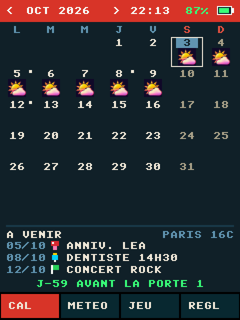
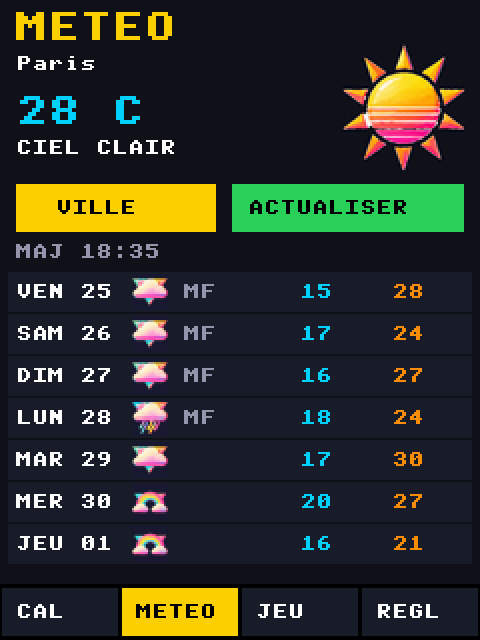
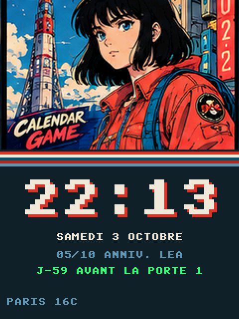
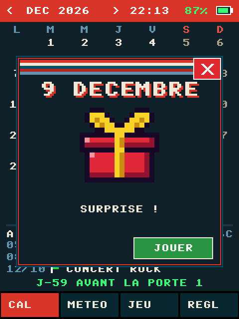
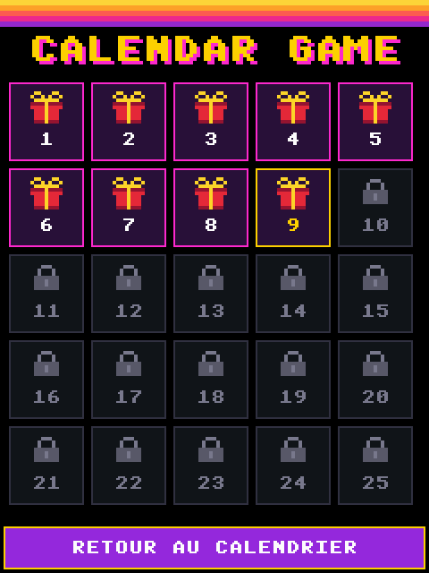
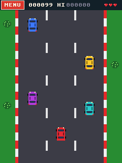

<p align="center"></p>

# Calendar Game

Une mini-télé rétro à écran tactile. Toute l'année, c'est un agenda avec la météo de la semaine. Du 1<sup>er</sup> au 25 décembre, c'est un calendrier de l'Avent : chaque jour, une fenêtre cadeau s'ouvre sur un jeu d'arcade façon années 80.

Le programme est écrit en MicroPython pour la carte **E32R28T**, une carte ESP32 avec écran tactile 2,8" de la famille « Cheap Yellow Display ». Après téléchargement du dépôt, ouvrir [`index.html`](index.html) dans le navigateur. Le bouton **Le montage** ouvre [`montage.html`](montage.html) : vidéo de branchement et vidéo d'installation du programme. Les fichiers sont dans `video/`. La jaquette à imprimer est dans [`visuels/jaquette.webp`](visuels/jaquette.webp) (vue à plat) et [`visuels/jaquette-decoupe.png`](visuels/jaquette-decoupe.png) (fichier avec traits de découpe). Le boîtier 3D est dans [`stl/`](stl/).

| Calendrier | Météo | Écran de veille |
|:---:|:---:|:---:|
|  |  |  |
| **Fenêtre cadeau** | **Calendrier de l'Avent** | **Jour 9 : Turbo 80** |
|  |  |  |

## Fonctionnalités

- **Calendrier (onglet CAL)** : le mois avec l'icône météo de chaque jour, l'heure et la jauge de batterie dans le bandeau, les trois prochains événements en bas de l'écran et le compte à rebours jusqu'à la première porte de l'Avent.
- **Notes** : une note par jour, saisie au clavier tactile, avec cinq thèmes (anniversaire, événement, oubli, rappel, tâche). Sous le clavier, un résumé de la météo du jour de la note : icône, températures maxi et mini, humidité moyenne, heures de lever et de coucher du soleil. Pour un jour au-delà des 7 jours de prévisions, c'est la météo d'aujourd'hui qui s'affiche.
- **Météo (onglet METEO)** : température actuelle et prévisions sur 7 jours (mini et maxi) pour la ville choisie. La ville se cherche par son nom. L'heure et la météo se mettent à jour toutes seules par le Wi-Fi.
- **Calendrier de l'Avent** : du 1<sup>er</sup> au 25 décembre, une fenêtre cadeau s'ouvre au premier allumage de la journée. Un bouton croix permet de la fermer sans jouer. Chaque jeu se lance aussi depuis sa case du calendrier. Les portes s'ouvrent à leur date, et un jeu déjà ouvert reste jouable ensuite.
- **Jeux (onglet JEU)** : la salle d'arcade, avec le record de chaque jeu enregistré sur la carte. Le jour 1 est jouable toute l'année. Un appui long de 2 secondes sur le titre de la salle active un mode test qui débloque tous les jeux. Une musique joue en boucle dans la salle (voir [Musique de la salle d'arcade](#musique-de-la-salle-darcade)).
- **Écran de veille** : après 3 minutes sans toucher l'écran, depuis le calendrier ou la météo, une des 12 images rétro s'affiche. En dessous : l'heure en grand, la date, le prochain événement, le compte à rebours de l'Avent, la météo et la batterie. L'image change toutes les 30 secondes. Sur batterie, l'écran s'éteint après 10 minutes de veille pour économiser la batterie. Toucher l'écran le rallume et ramène à la page d'avant.
- **Réglages (onglet REGL)** : heure, date et fuseau horaire, volume de 0 (muet) à 10, synchronisation par Internet, choix du réseau Wi-Fi, saisie de l'heure au clavier (CLAVIER) et calibration de l'écran tactile (POINTEUR).

### Les jeux

| Jour | Jeu | Principe |
|---:|---|---|
| 1 | Magic Harry | Casse-briques magique |
| 2 | Star Raid | Tir vertical, le vaisseau suit le doigt |
| 3 | Serpent 80 | Le serpent part vers le doigt : manger sans se mordre |
| 4 | Ping 80 | Duel de raquettes contre l'ordinateur, premier à 7 |
| 5 | Envahisseurs | Formation à descendre, un missile à la fois, abris |
| 6 | Rochers 80 | Le vaisseau reste au centre et vise avec le doigt |
| 7 | Route 80 | Traverser deux routes sans se faire écraser |
| 8 | Bomb Dodge | Esquiver les bombes et ramasser les pièces |
| 9 | Turbo 80 | Course vue de dessus, doubler sans toucher |
| 10 | Hélico 80 | Doigt posé, l'hélico monte ; doigt levé, il descend |
| 11 | Paires 80 | Retrouver les paires avant la fin du temps |
| 12 | Blocs 80 | Empiler les pièces pour compléter des lignes |
| 13 | Cibles 80 | Toucher les oiseaux avant qu'ils s'envolent |
| 14 | Défenseur | Protéger les humains des envahisseurs |
| 15 | Mineur 80 | Creuser, ramasser les diamants, éviter les rochers |
| 16 | Alunissage | Se poser en douceur sur une piste |
| 17 | Sauteur 80 | Rebondir de barre en barre, le doigt dirige |
| 18 | Fire Escape | Rattraper les sauteurs avec le trampoline |
| 19 | Zombie Night | Tirer sur les zombies, viser la tête |
| 20 | Labyrinthe | La bille suit le doigt jusqu'à la sortie |
| 21 | Crystal Catch | Attraper les cristaux, éviter les bombes |
| 22 | Réaction 80 | Toucher la case qui s'allume, de plus en plus vite |
| 23 | Aiguillages | Envoyer chaque train vers la gare de sa couleur |
| 24 | Boss Rush | Enchaîner les boss, le vaisseau suit le doigt |
| 25 | Championnat | Quatre épreuves : course, saut, tir, haies |

## Matériel

### La carte

| | |
|---|---|
| Modèle | E32R28T, vendue par LCDWIKI sous le nom « 2.8inch ESP32-32E Display » |
| Processeur | ESP32-D0WD-V3 (module ESP32-32E), 2 cœurs à 240 MHz |
| Mémoire | 520 Ko de RAM, sans PSRAM, 4 Mo de flash |
| Radio | Wi-Fi 2,4 GHz (802.11 b/g/n) et Bluetooth 4.2, classique et BLE (le Bluetooth n'est pas utilisé) |
| Écran | TFT couleur 2,8", 240 × 320 pixels, contrôleur ILI9341 en SPI |
| Tactile | Résistif, contrôleur XPT2046 |
| USB | USB-C, convertisseur série CH340C |
| Son | Sortie haut-parleur avec amplificateur |
| Stockage | Lecteur microSD (pas utilisé par le programme) |
| Alimentation | 5 V par l'USB-C, ou batterie LiPo 1S avec chargeur TP4054 intégré |

### Brochage utilisé par le programme

| Fonction | Broches (GPIO) |
|---|---|
| Écran ILI9341 (SPI matériel) | SCK 14, MOSI 13, MISO 12, CS 15, DC 2, rétroéclairage 21 |
| Tactile XPT2046 (SPI logiciel) | SCK 25, MOSI 32, MISO 39, CS 33 |
| Haut-parleur | 26 (musique par le convertisseur numérique-analogique, bruitages des jeux en PWM), amplificateur activé par 4 à l'état bas |
| Tension de la batterie | 34 (entrée analogique, derrière un pont diviseur par 2) |
| microSD (libre) | CS 5, SCK 18, MISO 19, MOSI 23 |
| Connecteur d'extension (libre) | 35 (entrée seulement), 27, 3,3 V, GND |

### Batterie

La carte fonctionne sur batterie et la recharge par l'USB-C. On peut laisser la batterie branchée en permanence, même avec l'USB : quand l'USB est branché, un transistor isole la batterie du reste de la carte, l'USB alimente la carte et la batterie ne fait que se charger.

| | |
|---|---|
| Type | LiPo ou Li-ion à **un seul élément (1S)** : 3,7 V nominal, 4,2 V chargée, avec circuit de protection intégré |
| Capacité | 300 mAh minimum (le courant de charge est d'environ 290 mA), 1000 mAh ou plus conseillé |
| Connecteur | 2 broches au pas de 1,25 mm (type MX1.25) : **rouge = +**, **noir = −** |
| Charge | Puce TP4054, environ 290 mA, arrêt à 4,2 V |
| Autonomie | Pas encore mesurée sur une décharge complète |

> [!WARNING]
> Vérifie la polarité au multimètre avant de brancher une batterie : un connecteur inversé grille la carte. Ne branche jamais sur la prise batterie une LiPo 2S (7,4 V), une batterie LiFePO4, des piles ou une alimentation 5 V.

#### La jauge de batterie

Le module [`battery.py`](firmware/battery.py) affiche le pourcentage à droite du bandeau du calendrier :

- **Sur USB** : l'icône est verte et se remplit en boucle, le pourcentage est en vert. À 100 %, l'icône reste pleine.
- **Sur batterie** : l'icône est fixe. La jauge est verte au-dessus de 50 %, jaune entre 20 et 50 %, rouge en dessous de 20 %.

La carte n'a aucun signal qui indique si l'USB est branché. Le programme le devine à partir de la tension de la batterie :

- **Au branchement et au débranchement**, la tension saute d'environ 65 mV : elle monte quand la charge commence, elle baisse quand la batterie se met à alimenter la carte. Le sens du saut indique si l'USB vient d'être branché ou débranché.
- **Au démarrage**, le programme éteint six fois le rétroéclairage pendant 25 ms, pendant que l'écran est encore noir. Sur USB, la batterie est isolée de la carte et sa tension ne bouge pas. Sur batterie seule, elle remonte de quelques millivolts parce que la batterie débite moins. L'effet étant proche du bruit de mesure, le programme retient la valeur médiane des six essais.
- **Toutes les 5 minutes**, il compare la tension à celle d'il y a 10 minutes. Si elle monte alors qu'il se croyait sur batterie, ou baisse alors qu'il se croyait sur USB, il corrige.

Le pourcentage vient de la tension mesurée sur IO34, corrigée de l'effet du courant : on retire 45 mV pendant la charge et on ajoute 25 mV sur batterie. La tension corrigée est ensuite convertie en pourcentage par cette courbe de décharge LiPo :

| Tension (V) | 4,20 | 4,10 | 4,00 | 3,90 | 3,80 | 3,75 | 3,70 | 3,65 | 3,60 | 3,50 | 3,40 | 3,30 |
|---|---|---|---|---|---|---|---|---|---|---|---|---|
| Charge | 100 % | 90 % | 79 % | 67 % | 52 % | 42 % | 30 % | 18 % | 10 % | 4 % | 1 % | 0 % |

Pour éviter que le chiffre fasse du yo-yo, il ne peut que baisser sur batterie et que monter en charge. C'est une estimation à 5 ou 10 % près, surtout pendant la charge.

## Installation

Le branchement de la carte, de la batterie et du haut-parleur est décrit dans [`docs/raccordement.md`](docs/raccordement.md). Pour mettre le programme sur la carte : [`docs/installer.md`](docs/installer.md).

### Ce qu'il faut

- La carte E32R28T et un câble USB-C qui transmet les données (certains câbles ne font que charger).
- Python 3.11 ou plus récent sur l'ordinateur (Windows, macOS ou Linux).
- Sous Windows, le pilote CH340 si la carte n'apparaît pas comme port COM.
- Les outils Python :

```sh
pip install -r firmware/requirements.txt
```

Les scripts utilisent le port `COM4` par défaut. Si ta carte est sur un autre port, définis la variable `PORT_CARTE` avant de lancer les scripts :

```powershell
$env:PORT_CARTE = "COM5"            # PowerShell
```

```sh
export PORT_CARTE=/dev/ttyUSB0      # macOS / Linux
```

### Première installation

Cette commande **efface complètement la carte** : elle télécharge MicroPython 1.29.0, l'installe, puis copie le programme.

```sh
cd firmware
python flash.py
```

Si le fichier `firmware_calendar.bin` est présent (voir [Firmware maison](#firmware-maison-modules-gelés)), `flash.py` installe ce firmware à la place, sans rien effacer.

### Mettre à jour le programme

Cette commande garde les notes, les réglages et les records. Elle compile les modules en `.mpy`, les copie sur la carte et la redémarre.

```sh
cd firmware
python deploy.py
```

Avec le firmware maison, le code est dans le firmware : après une modification, recompile-le avec `python build_firmware.py`, puis installe-le avec `python flash.py`.

### Premier démarrage

1. Dans **REGL**, touche **WIFI**, choisis ton réseau et tape le mot de passe sur le clavier de l'écran.
2. Dans **METEO**, touche **VILLE** et cherche ta ville par son nom.
3. L'heure se règle toute seule par Internet. Pour la France, le fuseau est +2 en été et +1 en hiver (réglage FUSEAU dans REGL).

La case **RETENIR LE MOT DE PASSE**, cochée par défaut sur l'écran du mot de passe, garde le réseau en mémoire après une connexion réussie. La carte retient ainsi jusqu'à 5 réseaux, marqués **CONNU** dans la liste, et leur mot de passe est déjà rempli quand on les choisit à nouveau. Elle se connecte toute seule au premier réseau connu qu'elle voit : au démarrage, puis à chaque mise à jour de l'heure ou de la météo si la connexion est perdue. Par exemple, la box à la maison et le partage de connexion du téléphone ailleurs.

Case décochée, la carte se connecte pour cette fois seulement et n'enregistre pas le mot de passe. Pour oublier un réseau connu, choisis-le, décoche la case, puis touche **OK**.

Si la mémoire réservée au Wi-Fi est pleine (après des jeux, par exemple), la carte redémarre toute seule pour chercher les réseaux ou s'y connecter, puis revient sur l'écran Wi-Fi.

### Partage de connexion d'un téléphone

L'ESP32 ne capte que le Wi-Fi 2,4 GHz.

- **iPhone** : active **Maximiser la compatibilité** dans Réglages > Partage de connexion, sinon le partage passe en 5 GHz. Garde cet écran ouvert pendant la recherche, car l'iPhone ne rend son réseau visible que pendant ce temps.
- **Android** : dans les réglages du point d'accès, choisis la bande **2,4 GHz** (pas « 5 GHz » ni « 5 GHz de préférence »). Si la connexion échoue, choisis la sécurité **WPA2**.

## Firmware maison (modules gelés)

### Pourquoi

Sur cette carte sans PSRAM, la limite est la RAM. Avec MicroPython officiel, chaque module `.mpy` est chargé en RAM : l'application en occupe environ 55 Ko. La mémoire système (celle d'ESP-IDF, dont ont besoin le Wi-Fi et le HTTPS) n'avait plus que 25 Ko libres, et les connexions HTTPS échouaient.

`build_firmware.py` compile MicroPython 1.29.0 avec les 35 modules de l'application **gelés** dans la flash (liste dans `manifest_calendar.py`). Un module gelé s'exécute directement depuis la flash, sans être copié en RAM. Le firmware contient aussi le module C `audio` (dossier `audio/`), qui joue la musique de la salle d'arcade.

| Mesure | Firmware officiel | Firmware maison |
|---|---:|---:|
| Modules de l'application en RAM | 55 Ko | 9 Ko |
| Mémoire système libre | 25 Ko | 85 Ko |
| Plus grand bloc libre de la mémoire système | 25 Ko | 82 Ko |
| Mémoire libre, application démarrée | 52 Ko | 118 Ko |
| Mémoire libre après calendrier, veille, météo et les 25 jeux | 43 Ko | 115 Ko |
| Mémoire utilisée à la fin de ce même parcours | 94 Ko | 23 Ko |

Le **HTTPS fonctionne désormais** : Open-Meteo répond en 0,7 s et la page d'accueil de Google (90 Ko) se télécharge en entier. Avec le firmware officiel, la connexion échouait (erreur `OSError 116`) ou bloquait la carte.

### Compiler

La compilation se fait dans WSL (Windows 11). La première installation prend environ 15 minutes et 4 Go dans WSL : paquets système, ESP-IDF 5.5.2 et MicroPython 1.29.0.

```powershell
wsl --install -d Ubuntu-24.04     # si WSL n'est pas encore installé
cd firmware
python build_firmware.py --setup  # une seule fois
python build_firmware.py          # après chaque modification du code
```

`build_firmware.py` copie les sources dans `~/esp/calendar` sous WSL (`make` ne supporte pas les espaces dans les chemins), compile, puis dépose `firmware_calendar.bin` dans le dossier du programme. Il affiche la taille de l'application par rapport à la partition de 2 031 616 octets : environ 1,94 Mo, soit 95 % (94 Ko libres). Si ton nom d'utilisateur dans WSL n'est pas `utilisateur`, définis la variable `WSL_USER`.

### Installer

```sh
python flash.py
```

Quand `firmware_calendar.bin` existe, `flash.py` l'écrit à l'adresse `0x1000` **sans effacer la carte** : la table des partitions ne change pas, donc les notes, les réglages et les records restent en place. Il lance ensuite `deploy.py --frozen`, qui copie seulement les fichiers simples (`boot.py`, `boardio.py`, `main.py`, les images `.raw` et `musique.adp` s'il existe) et retire de la carte les `.mpy` des modules gelés.

### Revenir au firmware officiel

Écris le firmware officiel ([`ESP32_GENERIC-20260824-v1.29.0.bin`](https://micropython.org/resources/firmware/ESP32_GENERIC-20260824-v1.29.0.bin)) à l'adresse `0x1000`, toujours sans effacer, puis recopie les modules en `.mpy` (remplace `COM4` par le port de ta carte) :

```sh
python -m esptool --chip esp32 --port COM4 --baud 460800 write-flash -z 0x1000 ESP32_GENERIC-20260824-v1.29.0.bin
python deploy.py
```

N'utilise pas `flash.py` pour revenir en arrière : si `firmware_calendar.bin` est présent, il réinstalle le firmware maison ; sinon, il efface toute la carte.

### Attention aux `.mpy` sur la carte

MicroPython cherche les modules d'abord dans les fichiers de la carte, puis dans le firmware (`sys.path` vaut `['', '.frozen', '/lib']`). Un `kartcal.mpy` laissé sur la carte **masque** donc le `kartcal` gelé : c'est la version du fichier qui tourne, pas celle du firmware, et elle reprend de la RAM. `deploy.py --frozen` retire ces fichiers. Pour essayer une modification sans reflasher, tu peux copier un `.mpy` sur la carte, à condition de le supprimer ensuite.

## Musique de la salle d'arcade

Dans l'onglet **JEU**, une musique joue en boucle. Elle s'arrête pendant les parties, pour laisser la place aux bruitages des jeux, et reprend au retour dans la salle. L'indication **SON** en haut à gauche de la salle coupe la musique : elle devient **MUET**, et ce choix est gardé sur la carte avec les records. Un nouvel appui remet la musique.

La musique demande le firmware maison (module C `audio`) et le fichier `musique.adp` sur la carte. Sans l'un ou l'autre, la salle reste silencieuse, sans message d'erreur, et l'indication SON n'apparaît pas.

### Mettre sa musique

La musique n'est pas fournie dans le dépôt : la licence des morceaux libres de droits permet en général de les utiliser dans un projet, mais pas de les redistribuer seuls. Pour installer un morceau (mp3, wav, ogg…) :

```sh
cd firmware
pip install imageio-ffmpeg numpy
python convert_music.py chemin/vers/ma_musique.mp3
python deploy.py --frozen
```

`convert_music.py` produit :

- `musique.adp`, le fichier que joue la carte. `deploy.py` le copie s'il est présent.
- `musique_apercu.wav`, pour écouter sur l'ordinateur ce que la carte va jouer.

La conversion retire les basses, que le petit haut-parleur ne rend pas, et compresse le son pour qu'il soit plus fort. Le fichier prend 5,5 Ko par seconde de musique. Le programme laisse environ 1 Mo libre sur la carte, soit 3 minutes de musique au plus.

Le volume se règle dans **REGL**, de 0 (muet) à 10. Il s'applique à la musique de la salle et aux bruitages des jeux, et il est gardé sur la carte avec les autres réglages.

### Fonctionnement

La carte n'a pas de décodeur MP3 et pas assez de mémoire pour en faire tourner un. La musique est donc convertie sur l'ordinateur en IMA ADPCM, mono, 4 bits par échantillon, à 11 025 Hz. Le module C `audio` décode ce format et écrit chaque échantillon sur le convertisseur numérique-analogique de la broche 26, 11 025 fois par seconde, depuis une interruption de timer. Il garde une réserve de 16 Ko, soit 1,5 s de musique. La boucle de la salle d'arcade lit le fichier par morceaux de 512 octets pour la remplir, sans créer d'objet en mémoire. La lecture prend environ 17 Ko de mémoire système, rendus à l'arrêt.

## Organisation du code

Tout le programme est dans [`firmware/`](firmware). Avec le firmware officiel, les fichiers de la carte sont compilés en `.mpy` par `deploy.py`, sauf `boot.py`, `boardio.py` et `main.py`, qui sont copiés tels quels. Avec le firmware maison, les modules sont gelés dans le firmware et seuls ces trois fichiers et les images sont copiés.

| Fichier | Rôle |
|---|---|
| `boot.py` | Cherche les réseaux et se connecte au premier réseau connu visible dès le démarrage, avant de charger le reste : ensuite la mémoire serait trop morcelée pour le pilote Wi-Fi |
| `boardio.py` | Garde les objets créés par `boot.py` (Wi-Fi, bus SPI) |
| `main.py` | Lance l'application |
| `kartcal.py` | L'application : calendrier, notes, météo, réglages, clavier, boucle principale |
| `ili9341.py` | Pilote de l'écran |
| `font8.py` | Police 8 × 8 pixels et affichage rapide du texte |
| `xpt2046.py` | Lecture et calibration de l'écran tactile |
| `store.py` | Enregistrement des réglages et des notes sur la carte |
| `net.py` | Wi-Fi, heure par Internet, recherche de ville et météo |
| `battery.py` | Mesure de la batterie, détection de l'USB, pourcentage |
| `arcade.py` | Moteur commun des jeux : sprites, score, sons, records |
| `advent.py` | Calendrier de l'Avent : fenêtre cadeau, grille des portes, salle d'arcade, lancement des jeux |
| `musique.py` | Lecture en boucle de la musique de la salle d'arcade (fichier `.adp`) |
| `game.py`, `j02.py` … `j25.py` | Les 25 jeux (`game.py` est le jour 1) |
| `logo.raw`, `wxn18.raw`, `wxp18.raw`, `wxa64.raw`, `veille.raw` | Logo, icônes météo et les 12 images de l'écran de veille, déjà converties au format de l'écran |

Outils à lancer sur l'ordinateur :

| Fichier | Rôle |
|---|---|
| `flash.py` | Installe MicroPython puis le programme (efface la carte), ou le firmware maison sans rien effacer si `firmware_calendar.bin` existe |
| `deploy.py` | Met à jour le programme sans effacer les données (`--frozen` pour le firmware maison) |
| `build_firmware.py` | Compile le firmware maison dans WSL, avec les modules de l'application gelés, et produit `firmware_calendar.bin` |
| `manifest_calendar.py` | Liste des modules gelés dans le firmware maison |
| `audio/audio.c`, `audio/micropython.cmake` | Module C `audio` du firmware maison : décodage ADPCM et sortie sur le convertisseur numérique-analogique |
| `convert_music.py` | Convertit une musique (mp3, wav…) en fichier `.adp` pour la carte |
| `restore_backup.py` | Recopie des réglages et des notes sauvegardés dans `firmware/backup_carte/` |
| `make_logo.py` | Convertit `logo.png` en `logo.raw` |
| `make_wx.py` | Découpe la planche `meteo_icones.png` en icônes `wx*.raw` |
| `make_veille.py` | Découpe la planche `veille.png` en 12 images, sans la fausse barre d'état, dans `veille.raw` |

Les réglages (`config.json`, `wifi.json`, avec le mot de passe Wi-Fi), les notes (`notes.json`) et les records (`records.json`) restent sur la carte. Ils ne font pas partie du dépôt, et le fichier `.gitignore` les exclut, comme la musique convertie (`musique.adp`).

### Choix techniques

- **Modules gelés ou précompilés** : la carte n'a pas assez de mémoire pour compiler elle-même les gros fichiers. Le firmware maison contient les modules déjà compilés et gelés en flash (voir [Firmware maison](#firmware-maison-modules-gelés)). Avec le firmware officiel, `deploy.py` les compile sur l'ordinateur avec `mpy-cross`.
- **Météo en HTTP** : avec le firmware officiel, une connexion HTTPS demande environ 40 Ko de mémoire d'un seul bloc, que la carte n'a plus une fois le programme chargé. Le firmware maison laisse assez de mémoire pour le HTTPS, mais la météo reste en HTTP simple, qui demande moins de mémoire : Open-Meteo l'accepte et ne demande pas de clé. La réponse est décodée au fil de la connexion, sans être gardée entière en mémoire.
- **Mémoire pleine** : avec le firmware maison, il reste environ 118 Ko libres une fois le programme chargé (52 Ko avec le firmware officiel), et les plus gros jeux en prennent près de 18 Ko. Les grandes images (icône météo de 64 × 64 pixels, cadeau de l'Avent, dessins des écrans titres des jeux) sont envoyées à l'écran par petits morceaux de 1 Ko au plus : après des heures d'utilisation, la mémoire est morcelée et n'a plus de gros bloc libre. Si une erreur survient quand même, l'application revient au calendrier (ou affiche « MÉMOIRE PLEINE » dans un jeu) au lieu de se figer. La trace est ajoutée à `erreur.txt` sur la carte. Après 3 erreurs en 2 minutes, la carte redémarre toute seule, sans attendre START, et s'arrête sur l'écran d'erreur après 3 redémarrages de suite.
- **Affichage** : les icônes sont préparées sur l'ordinateur pour chaque couleur de fond, et le texte passe par une fonction compilée en code machine (`@micropython.viper`). Un rafraîchissement complet du calendrier prend environ 0,7 s.

## Crédits

- [MicroPython](https://micropython.org/)
- Données météo : [Open-Meteo](https://open-meteo.com/) (licence CC BY 4.0), avec les modèles de Météo-France (AROME et ARPEGE) pour les 4 premiers jours
- Police 8 × 8 pixels du domaine public
- Musique de la salle d'arcade : non fournie, à convertir soi-même
- Icônes météo et images de l'écran de veille : planches générées par IA, découpées et converties par `make_wx.py` et `make_veille.py`
