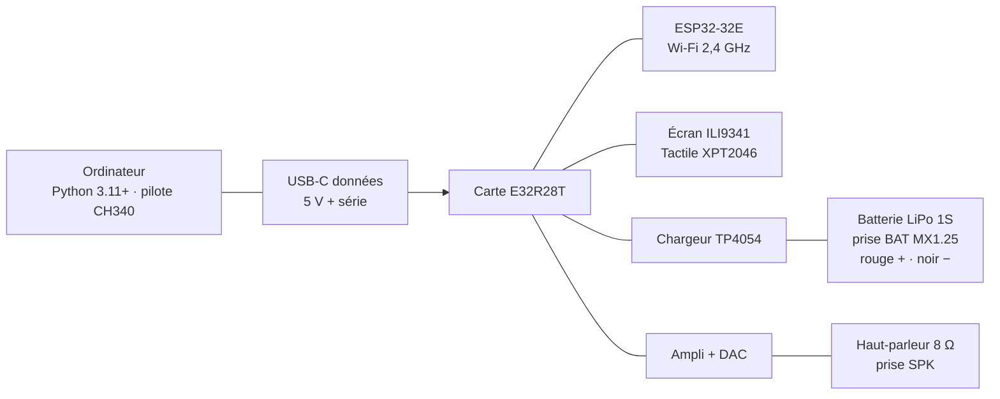

# Raccordement Calendar Game

Notice de branchement : les appareils, le schéma, puis les étapes dans l’ordre. Aucune soudure n’est nécessaire. L’écran, le tactile, le Wi-Fi, l’ampli, le chargeur et l’USB sont déjà sur la carte.

## Appareils

### À réunir

| Appareil | Rôle |
|---|---|
| Carte **E32R28T** (LCDWIKI « 2.8inch ESP32-32E Display ») | Console : processeur, écran 2,8", tactile, Wi-Fi |
| Câble **USB-C avec les données** | 5 V, charge, et port série pour installer le programme. Un câble « charge seule » ne suffit pas |
| Batterie **LiPo 1S** | Un seul élément, 3,7 V nominal, 4,2 V max, circuit de protection, prise **MX1.25** 2 broches. 300 mAh minimum, 1000 mAh ou plus conseillé |
| Haut-parleur **8 Ω** | Seulement s’il n’est pas déjà sur la prise SPK |
| Ordinateur | Windows, macOS ou Linux, Python 3.11 ou plus. Sous Windows : pilote CH340 si aucun port COM n’apparaît |
| Multimètre | Contrôle de la tension et de la polarité **avant** le premier branchement de la batterie |

### Déjà sur la carte (ne pas recâbler)

- Module ESP32-32E (ESP32-D0WD-V3), 2 cœurs à 240 MHz, 4 Mo de flash, sans PSRAM
- Écran TFT ILI9341 240 × 320
- Tactile résistif XPT2046
- Convertisseur USB CH340C sur la prise USB-C
- Chargeur TP4054 (~290 mA, arrêt à 4,2 V) et isolation de la batterie quand l’USB est branché
- Ampli haut-parleur (GPIO 4 à l’état bas pour l’allumer, son sur GPIO 26)
- Pont diviseur vers GPIO 34 pour la jauge de batterie
- Lecteur microSD et connecteur d’extension : libres, le programme ne s’en sert pas

## Schéma



Deux prises seulement à enficher : **SPK** (haut-parleur, si besoin) et **BAT** (batterie). Le reste est déjà soudé.

```
Ordinateur                    Carte E32R28T                         Accessoires
──────────                    ─────────────                         ───────────
Python 3.11+                  ┌─ ESP32-32E ─┐
pilote CH340  ── USB-C ─────► │  écran TFT  │ ── SPK 2 broches ──► Haut-parleur 8 Ω
              5 V + série     │  tactile    │
                              │  CH340C     │
                              │  TP4054     │ ── BAT MX1.25 ────► LiPo 1S
                              │  ampli      │     rouge = +
                              └─────────────┘     noir  = −
```

## Étapes, dans l’ordre

### 1. Rassembler le matériel

Pose sur la table : la carte, le câble USB-C données, la batterie 1S, le multimètre, et le haut-parleur s’il n’est pas déjà branché.

### 2. Repérer les prises

Sans rien brancher, tourne la carte.

- Face avant : écran 2,8" et tactile, déjà soudés
- Chant / face arrière : **USB-C**, prise batterie 2 broches (souvent **BAT**), prise haut-parleur 2 broches (souvent **SPK**), lecteur microSD (inutile ici), connecteur d’extension

### 3. Brancher le haut-parleur

S’il est déjà en place, passe à l’étape 4. Sinon, enfiche le haut-parleur 8 Ω sur **SPK**. L’ampli est sur la carte : pas de fil à souder vers l’ESP32.

### 4. Contrôler la batterie au multimètre

Mesure entre les deux fils **avant** d’enficher.

- Tu dois lire environ **3,7 V** (entre 3,3 V et 4,2 V)
- Rouge = **+**, noir = **−**
- Si tu lis **7,4 V**, c’est une 2S : ne la branche pas
- Un connecteur inversé peut griller le chargeur du premier coup

### 5. Allumer d’abord à l’USB, sans batterie

Branche le USB-C entre l’ordinateur et la carte, batterie encore débranchée.

- L’écran doit s’allumer
- Sous Windows, un port COM apparaît (souvent `COM4`)
- Si rien n’apparaît : pilote CH340, puis un autre câble (beaucoup de USB-C n’ont pas les fils de données)

### 6. Débrancher l’USB, puis enclencher la batterie

Enlève le câble. Aligne le MX1.25 : rouge sur +, noir sur −, pas de 1,25 mm. Enfonce à fond, sans forcer de travers. La carte peut s’allumer sur batterie. Si l’écran reste noir, revérifie le connecteur et la tension.

### 7. Rebrancher l’USB pour charger

Remets le USB-C. La carte tourne sur l’USB. Un transistor isole la batterie : elle ne fait que se charger (TP4054, ~290 mA, arrêt à 4,2 V). Les deux peuvent rester branchés en même temps. Dans le calendrier, la jauge passe en vert et se remplit en boucle tant que l’USB est là.

### 8. Installer le programme, puis le premier réglage

```sh
cd firmware
pip install -r requirements.txt
python flash.py          # première fois : efface la carte
# plus tard, pour garder notes et réglages :
python deploy.py
```

Port par défaut : `COM4`. Autre port :

```powershell
$env:PORT_CARTE = "COM5"            # PowerShell
```

```sh
export PORT_CARTE=/dev/ttyUSB0      # macOS / Linux
```

Au premier écran : **REGL → WIFI** (réseau **2,4 GHz**), puis **METEO → VILLE**. L’heure se règle toute seule. Le volume va de 0 (muet) à 10 dans REGL.

## Alimentation une fois tout branché

| Situation | Ce qui se passe |
|---|---|
| USB seul | La carte prend 5 V sur l’USB-C. Suffisant pour installer et s’en servir sur le bureau |
| Batterie seule | La carte prend 3,7 V sur BAT. En veille, l’écran s’éteint après 10 min ; un toucher le rallume |
| USB + batterie | L’USB alimente la carte et charge la batterie. On peut laisser les deux en place |

## Broches utilisées par le programme

Tu n’as pas à relier ces GPIO à la main : ils vont déjà aux puces de la carte.

| Fonction | GPIO | Rôle |
|---|---|---|
| Écran ILI9341 | 14, 13, 12, 15, 2, 21 | SCK, MOSI, MISO, CS, DC, rétroéclairage |
| Tactile XPT2046 | 25, 32, 39, 33 | SCK, MOSI, MISO, CS (SPI logiciel) |
| Haut-parleur | 26 et 4 | 26 = DAC / PWM, 4 = ampli actif à l’état bas |
| Jauge batterie | 34 | Entrée analogique, pont diviseur par 2 |
| microSD (libre) | 5, 18, 19, 23 | CS, SCK, MISO, MOSI |
| Extension (libre) | 35, 27, 3,3 V, GND | 35 en entrée seulement |

## À ne jamais brancher sur la prise BAT

- LiPo **2S** (7,4 V)
- Batterie LiFePO4
- Piles
- Alimentation 5 V
- Connecteur inversé (+ et − échangés)
